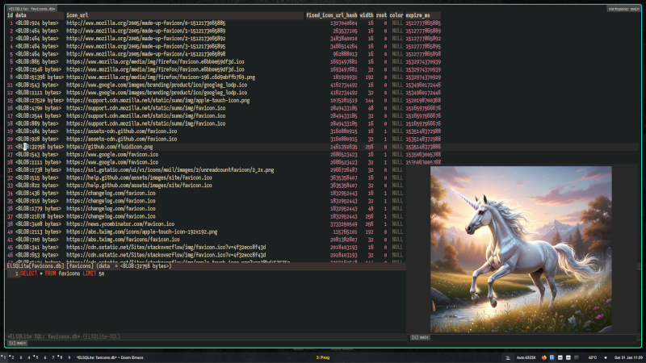

# ELSQLite - SQLite Browser for Emacs

[](https://github.com/dusanx/elsqlite/actions/workflows/test.yml)
[](https://github.com/dusanx/elsqlite/actions/workflows/melpazoid.yml)

A native Emacs SQLite browser that provides a unified interface for exploring and editing SQLite databases. Built on the philosophy that "everything is SQL" - the UI is a convenient way to build and modify queries, with bidirectional sync between SQL and visual representations.


*Query browser on top, SQL editor on bottom, automatic BLOB image preview in child frame*

## Features

- **Two-Panel Interface**: Results panel (top) shows data; SQL editor panel (bottom) shows queries
- **Bidirectional Sync**: Navigate with UI → SQL updates; edit SQL → UI updates
- **Schema Browser**: Explore tables, views, and indexes with outline-based folding
- **Table Browser**: View and navigate table data with pagination
- **Column Navigation**: Move between columns with TAB/Shift-TAB
- **Advanced SQL Completion**: Context-aware completion with schema caching
  - Table and column names from live database schema
  - SQL keywords and functions (COUNT, SUM, DATE, etc.)
  - Smart clause detection (knows SELECT vs FROM vs WHERE vs UPDATE SET)
  - Table alias resolution (`FROM users u` → `u.column` completes to users columns)
  - Rich annotations showing column types and primary key markers
  - Automatic cache invalidation after schema modifications
- **Query History**: Navigate through previously executed queries with M-p/M-n
- **Query Restoration**: Automatic restore of previous SELECT after modification queries
- **BLOB Image Preview**: Automatic preview of PNG, JPEG, GIF, BMP, and WEBP images in child frame
- **BLOB Handling**: Binary data displayed as `<BLOB:N bytes>` instead of garbage

## Requirements

- Emacs 29.1 or later (with SQLite support)
- No external dependencies

To check if your Emacs has SQLite support:
```elisp
M-: (sqlite-available-p) RET
```

If this returns `t`, you're good to go!

## Installation

Choose the section that matches your setup and copy-paste the entire code block:

### Vanilla Emacs + MELPA (coming soon)

Add to your `init.el`:
```elisp
(use-package elsqlite
  :ensure t
  ;; Optional: Auto-open .db files in ELSQLite
  :config
  (elsqlite-enable-auto-open)
  ;; Optional: Evil mode keybindings
  ;; (elsqlite-evil-setup)
  )
```

### Vanilla Emacs + From Source

1. Clone the repository:
```bash
git clone https://github.com/dusanx/elsqlite.git ~/path/to/elsqlite
```

2. Add to your `init.el`:
```elisp
(add-to-list 'load-path (expand-file-name "~/path/to/elsqlite"))
(require 'elsqlite)

;; Optional: Auto-open .db files in ELSQLite
(elsqlite-enable-auto-open)

;; Optional: Evil mode keybindings
;; (elsqlite-evil-setup)
```

### Doom Emacs + MELPA (coming soon)

Add to `~/.doom.d/packages.el`:
```elisp
(package! elsqlite)
```

Add to `~/.doom.d/config.el`:
```elisp
(use-package! elsqlite
  :commands (elsqlite elsqlite-browser)
  :config
  ;; Optional: Auto-open .db files in ELSQLite
  (elsqlite-enable-auto-open)
  ;; Optional: Evil mode keybindings
  ;; (elsqlite-evil-setup)
  )
```

Then run: `doom sync`

### Doom Emacs + From Source

1. Clone the repository:
```bash
git clone https://github.com/dusanx/elsqlite.git ~/path/to/elsqlite
```

2. Add to `~/.doom.d/config.el`:
```elisp
(add-to-list 'load-path (expand-file-name "~/path/to/elsqlite"))
(require 'elsqlite)

;; Optional: Auto-open .db files in ELSQLite
(elsqlite-enable-auto-open)

;; Optional: Evil mode keybindings
;; (elsqlite-evil-setup)
```

Then reload config: `SPC h r r` or restart Emacs

## Usage

### Opening a Database

**Interactive (M-x):**
```elisp
M-x elsqlite RET /path/to/database.db RET
M-x elsqlite-browser RET   ;; alias
```

**Programmatic (from Elisp):**
```elisp
(elsqlite "/path/to/database.db")
(elsqlite "~/data/customers.db")
```

**Auto-open .db files (optional):**

Vanilla Emacs - add to `init.el` (after the `require` line from installation):
```elisp
(add-to-list 'load-path "/path/to/elsqlite")
(require 'elsqlite)
(elsqlite-enable-auto-open)  ; Optional: auto-open .db files

;; To disable later: M-x elsqlite-disable-auto-open
```

Doom Emacs - already configured if you followed installation step 2 above.

Now `C-x C-f database.db` opens in ELSQLite instead of raw bytes.

**Quick keybinding for a specific database:**

Vanilla Emacs:
```elisp
(global-set-key (kbd "C-c d")
  (lambda () (interactive) (elsqlite "~/my-project.db")))
```

Doom Emacs - add to `config.el`:
```elisp
(map! :leader
      :desc "Open project database"
      "o d" (cmd! (elsqlite "~/my-project.db")))
;; Now: SPC o d opens your database
```

### Basic Navigation

**Window Management**:
- `C-x o` - Switch between SQL and results panels
- `C-x 0` - Delete current window (closes database if it's an ELSQLite window)
- Evil users: `C-w w`, `C-w h/j/k/l` work as expected (call `elsqlite-evil-setup` for mode-specific bindings)

**SQL Panel**:
- `C-c C-c` - Execute query
- `M-p` / `M-n` - Navigate query history
- `TAB` - SQL completion (standard `completion-at-point`)

**Schema Browser** (results panel showing schema):
- `RET` - Open table
- `TAB` - Toggle fold/unfold CREATE statements
- `q` - Quit ELSQLite and close both panels

**Table Browser** (results panel showing table):
- `TAB` / `Shift-TAB` - Move to next/previous column
- `^` or `Shift-U` - Return to schema browser
- `n` / `p` - Next/previous row (standard `tabulated-list-mode`)
- `C-c C-w` - Copy current field value to clipboard
- `C-c C-s` - Save current field to file (prompts with file type hint)
- `C-c C-o` - Open current BLOB image in external viewer
- BLOB images automatically preview in child frame when cursor is on BLOB column

## Example Workflow

1. **Open a database**: `M-x elsqlite RET mydata.db RET`
   - You'll see the schema browser listing all tables, views, and indexes
   - SQL panel shows the query that generates this view
   - Press `TAB` on a CREATE statement to fold/unfold it

2. **Browse a table**: Move to a table and press `RET`
   - Table contents appear in the results panel (first ~200 rows)
   - SQL panel updates to show `SELECT * FROM tablename`
   - Mode line shows `ELSQLite[database.db] [1/200/more to load]`
   - Scroll down to auto-load more rows

3. **Navigate columns**: Use `TAB` / `Shift-TAB` to move between columns
   - If a column contains a BLOB image, it automatically previews in a child frame
   - Preview follows cursor as you navigate up/down in the same column

4. **Edit SQL directly**: Switch to SQL panel with `C-x o`
   - Modify the query to sort: `SELECT * FROM users ORDER BY age DESC`
   - Add a filter: `SELECT * FROM users WHERE age > 21`
   - Press `C-c C-c` to execute
   - Results panel updates automatically

5. **Query history**: In SQL panel, use `M-p` and `M-n`
   - Navigate through previously executed queries
   - Edit and re-execute as needed

6. **Return to schema**: From table view, press `^` or `Shift-U`
   - Returns to schema browser
   - Press `q` to quit ELSQLite

## Mode Line

The mode line shows contextual information as you navigate:

- **`[1]`** - Session identifier (every database open gets a unique number)
- **`ELSQLite[database.db] [Schema]`** - Viewing schema browser
- **`ELSQLite[database.db] [150/200/more to load]`** - Viewing table/query, on row 150 of 200 loaded, more available
- **`ELSQLite[database.db] [150/200]`** - Viewing table/query, on row 150 of 200 total
- **`ELSQLite[database.db] [/200/more to load]`** - Past last row or at header, 200 loaded, more available
- **`(column TYPE = value)`** - Current field info (appears when cursor is on a cell)

Examples:
- First database: `[1] ELSQLite[customers.db] [42/200/more to load] (name TEXT = John)`
- Second database: `[2] ELSQLite[orders.db] [Schema Viewer]`
- Third database: `[3] ELSQLite[products.db] [15/100]`

Each database session gets a unique, ever-incrementing identifier (`[1]`, `[2]`, `[3]`, etc.) shown in **bold** at the start of the mode line in both SQL and View panels. This makes it easy to quickly identify and jump between window pairs, regardless of which database is open.

## Architecture

```
elsqlite/
├── elsqlite.el         # Main entry point, mode coordination
├── elsqlite-db.el      # Database operations, schema caching
├── elsqlite-sql.el     # SQL panel, completion, history
├── elsqlite-table.el   # Results panel, table browser
└── tests/
    ├── elsqlite-test.el   # ERT test suite
    └── test.db            # Sample test database
```

## Development

### Running Tests

```bash
emacs --batch -L . -L tests -l tests/elsqlite-test.el -f ert-run-tests-batch-and-exit
```

Or interactively:
```elisp
M-x load-file RET tests/elsqlite-test.el RET
M-x ert RET t RET
```

### Current Implementation Status

**Implemented** ✓
- [x] Open database and browse schema
- [x] Schema browser with outline-based folding
- [x] Table browser with pagination
- [x] Column navigation (TAB/Shift-TAB)
- [x] SQL panel bidirectional sync
- [x] Execute custom queries
- [x] Query complexity detection
- [x] Context-aware SQL completion
- [x] Query history (M-p/M-n)
- [x] Query restoration after modifications
- [x] BLOB image preview (PNG, JPEG, GIF, BMP, WEBP)

**Planned**
- [ ] Complete INSERT statement support (column lists and VALUES clause)
- [ ] Multi-statement completion (semicolon-separated queries) - Phase 2
- [ ] Subquery completion (nested SELECT statements) - Phase 2
- [ ] Comment-aware parsing (ignore keywords in SQL comments) - Phase 2
- [ ] Cell editing with dirty tracking
- [ ] Row deletion and insertion
- [ ] Transaction-based save/revert
- [ ] Interactive sorting keybinding
- [ ] Interactive filtering keybinding
- [ ] Record detail view
- [ ] Export to CSV/org-table/JSON
- [ ] Foreign key navigation

## Design Philosophy

### "Turtles All The Way Down"

Everything in ELSQLite is SQL. The UI doesn't hide SQL behind buttons and dialogs - it generates SQL and shows it to you. This creates a learning loop:

1. Navigate with arrow keys → see SQL update
2. Try sorting/filtering → see SQL change
3. Internalize patterns → start typing SQL directly
4. Graduate from UI-driven to SQL-driven workflow

This dual-input model serves both SQL novices and experts. The visible SQL panel is both a teaching tool and a power-user interface.

### Why Bidirectional Sync?

Most database tools separate browsing from querying. ELSQLite unifies them. The same view works both ways:
- **Bottom-up**: Navigate data visually, SQL appears
- **Top-down**: Write SQL, data appears

No mode switching, no context juggling - just work naturally and the tool adapts.

## Handling Large Datasets

ELSQLite uses **incremental streaming** to handle arbitrarily large result sets without loading everything into memory:

- **Initial Load**: First ~200 rows load immediately
- **Auto-Loading**: As you scroll down, more rows load automatically when you get within 20 rows of the bottom
- **Append-Only**: All loaded rows stay in memory (no complex windowing logic)
- **Memory Safety**: At 10,000 loaded rows, you'll get a warning with option to continue or stop
- **No Limits**: Browse tables with millions of rows - only what you've scrolled through is loaded

**Example:**
- Table with 1 million rows
- User scrolls to row 5,000
- Memory usage: ~5,000 rows (not 1 million)
- User can continue scrolling or refine query

This approach combines simplicity with practicality: most users won't manually scroll through 100,000 rows, but if you need to, it works.

## Configuration

Add to your `init.el` (vanilla) or `config.el` (Doom):

```elisp
;; Customize SQL panel height in lines (default: 10)
(setq elsqlite-sql-panel-height 15)

;; Customize maximum column width (default: 100)
;; Long strings and BLOBs are truncated to this length
(setq elsqlite-max-column-width 200)

;; Streaming configuration for large result sets
(setq elsqlite-streaming-batch-size 200)          ; Rows per batch (default: 200)
(setq elsqlite-streaming-load-threshold 20)        ; Auto-load when within N rows of end (default: 20)
(setq elsqlite-streaming-warning-threshold 10000)  ; Warn at N loaded rows (default: 10000)
```

## Troubleshooting

### "SQLite support not available"

Your Emacs build doesn't include SQLite support. Rebuild Emacs 29+ with SQLite libraries installed, or use a pre-built version with SQLite support.

### "Database file does not exist"

The file path you provided doesn't exist. Use `C-g` to cancel and check the path. The file chooser filters for `.db`, `.sqlite`, and `.sqlite3` extensions.

### Tests failing

Make sure you're running tests from the project root:
```bash
cd /path/to/elsqlite
emacs --batch -L . -L tests -l tests/elsqlite-test.el -f ert-run-tests-batch-and-exit
```

## Contributing

Contributions welcome! Please see [CONTRIBUTING.md](CONTRIBUTING.md) for details.

Quick guidelines:
1. Write tests for new features
2. Follow existing code style
3. Update README for user-facing changes
4. Keep the "everything is SQL" philosophy

## License

GPL-3.0-or-later - See [LICENSE](LICENSE) for full text.

## Author

Copyright (C) 2026 Dusan Popovic

A native Emacs SQLite browser that teaches SQL while you use it.
